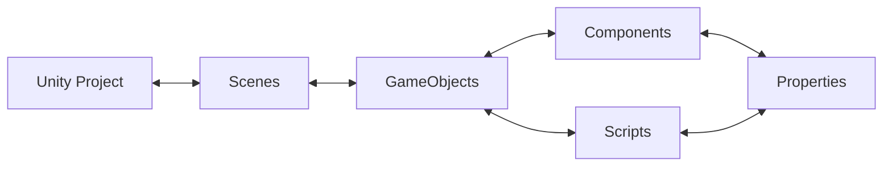

#### 🖥️Lab Note
Test Commit
This guide can be followed while using the GDA Computer Suite. Sections which are unique to the computer suite are marked with the 🖥️emoji

* * *

# Why Unity?

- Large and active community of professionals and hobbyists

- Used widely in many creative industry

- Cross-platform development

- Rich 2D and 3D capabilities

- Real-time experiences for AR, VR, mobile, desktop and web (Not limited to just games!)

- Continuous updates with LTS (Long Term Support) versions

- Free for students and personal use!

# Launching Unity

🖥️ The lab PCs are pre-installed with Unity 2022.3.34f

- **If you're using a later version (Unity 6 or above), your interface may differ from this guide but the content will still be relevant.**

- Type "Unity" into the Windows search box

- 🖥️` Important if using the Computer Lab: Click on “Unity 2022.3.34f1” not “Unity Hub”. This will still open the Unity Hub launcher, but will preload the editor into the launcher for you.**

- Once open, Unity Hub will ask you to sign in. If you don't have an account, create one with your student email.

# Creating your first project

![[1_Unity/0_Introduction/images/image.png]]

- Create a new Unity project through Unity Hub

![[Screenshot-2025-03-12-173000.png]]

- Choose the **Universal 3D** template

- Set your project name

- 🖥️**Computer Suite: Save the project to the D drive**

- Leave "Connect to Unity Cloud" checked

- Leave "Use Unity Version Control" unchecked - this is separate to Git Version Control and may cause confusion between the two

## Built-in Renderer/ URP/ HDRP

| ![[1_Unity/0_Introduction/images/image-2.png]]                                                       | ![[1_Unity/0_Introduction/images/image-4.png]]                                                                                                                                                                   | ![[1_Unity/0_Introduction/images/image-5.png]]                                                                                                                                                 |
| :--------------------------------------------------------------------------------------------------- | :--------------------------------------------------------------------------------------------------------------------------------------------------------------------------------------------------------------- | :--------------------------------------------------------------------------------------------------------------------------------------------------------------------------------------------- |
| **Built-In Renderer**   \- General Purpose + Legacy   \- This project type is being phased out | **Universal Render Pipeline (URP)**   \- Modern go-to option   \- Artist-friendly features   \- Best for cross-platform   \- **Best for most cases and is the recommended option for most projects** | **High Definition Render Pipeline (HDRP)**   \- Advanced graphical features intended for high-end hardware   \- Difficult to fully utilise   \- Ask if you need this for your project |

## Setting Up Version Control

In order to save and track changes to your project so that it can be accessed by you and your teammates from any machine, it is highly recommended to set up Git version control for your project.

## In Unity

![[Screenshot-2025-03-12-174521-1024x547.png]]

**Hierarchy**: Displays all the game objects in the current scene. Here you can manage the organization of objects. By default your project will have a Camera, a Light, and a "Global Volume" used for post processing effects.

**Scene**: A visual representation of the game world. This is where you can move, manipulate, and arrange objects in a 3D or 2D space.

**Inspector**: Shows detailed properties and settings for the currently selected game object, component, or asset. You can modify values like position, rotation, and script variables here.

**Project**/**Console**: Use the tab to change between these two windows.  
The Project window contains all the assets, scripts, and resources for your project. It’s organized into folders and allows you to manage the project’s files.  
The Console window will show you any errors/warnings in your project as well as any custom messages you wish to output here.

### Scenes

**Scene:** A space that holds all of the Game Objects needed for your game. A small game could only need one scene for the whole thing, while a bigger game might need one scene for every level or environment.

- For example, in a more complex project you can use scenes to organize your game by content:  
    \- \[Main Menu Scene\]  
    \- \[Level 1 Scene\]  
    \- \[Level 2 Scene\]  
    \- The scenes don't have to be sequential, for instance you could have \[Hub World\], \[Building 1\], \[Building 2\], \[Settings Menu\] as separate scenes.

- Scenes are essential for organization, performance, and robustness!
- For most purposes, you will only have one scene loaded in your game at a time.
- When you ‘save’ your Unity project, you are saving the currently loaded scene.

When you first load a project, Unity will create a new scene titled "SampleScene." You can find it within the Project panel under Assets/Scenes:

![[image-1-1024x187.png]]

It is a good idea to rename this scene. You can name it anything as long as it roughly describes the intended contents of the scene. We will be implementing a basic First Person Controller here, so name it "FirstPersonTesting" for now.

### GameObjects and Components

- **GameObjects**: Fundamental objects within Unity  
    A scene can have an unlimited number of GameObjects, representing anything and everything in your scene from your player; to props or weapons; to a terrain or building. Anything in your scene will be a GameObject.  
    A GameObject can have a mesh attached to it or be invisible.
    - GameObjects don't have any inherent functionality by themselves, but can be extended through the use of Components and Scripts.
    - A GameObject doesn't have to be something physical within your scene. For example we can use invisible GameObjects to hold scripts that run in the background.

- Unity has hundreds of built-in Components, but in many cases we will need to write our own Components in the form of C# Scripts.

### Creating your first GameObject

- Lets create a new GameObject which will represent our player.
- Create a new capsule object by **right-clicking within the Hierarchy window** and select  
    **3D Object -> Capsule**

![[image-1024x551.png]]

### Inspector Window

![[Screenshot-2025-03-12-180028.png]]

- Select the Capsule by clicking on it in the Hierarchy. You will see that it becomes highlighted
- The top of the inspector window allows you to activate/deactivate your object, rename it, as we all more advanced options which we will skip for now.

- This is followed by the object's components. On our capsule, by default these are:
    - **Transform**: All GameObjects include a Transform component. This defines the position, rotation, and scale of the object
    
    - **Mesh Filter**: Defines the mesh (3D model) for the object.
    
    - **Mesh Renderer:** Renderers the mesh defined by the Mesh Filter
    
    - **Capsule Collider:** Provides a collision mesh for the capsule. The collider is used to give objects physical interactivity within Unity's Physics system
    
    - **Material:** The material for the object. The default material can not be edited but a new material can be created and dragged here to replace it.

- Finally at the bottom you will find the "Add Component" button. Use it to browse the catalogue of Unity's built-in components. Any user-made scripts will also be available here. Note that not all components are compatible with each other and some components can only be added once per object.

**Use the inspector to set the position of the Capsule to X: 0, Y: 5, Z: 0**

![[image-5 1.png]]
### Properties

- We can interact with components and scripts through properties.

- Each component/script has its own set of properties which can be edited

![[Screenshot-2025-03-12-184823.png]]
If you are ever unsure what a property does, just hover over it!

_Tip: Googling “Unity Capsule Collider” or any other Component name will often give you the documentation page for the component as one of the first results. Don’t worry about the details for now though!_

### Recap of Structure

- A Unity Project can have any number of Scenes

- A scene can have any number of GameObjects

- A GameObject will always have Transform and Material components, as well any number of other built-in components or Scripts

- Components and scripts will have properties which you can manipulate

## Play Mode

![[1_Unity/0_Introduction/images/image-25.png]]

Play Mode is a core feature in Unity that lets you test your game directly in the editor. Think of it as a "preview" of your game that you can run at any time. You can find the play mode controls at the top of the Unity editor.  
When you enter Play Mode:

1. Unity compiles your scripts, turning them into internal code for Unity to run.
2. The editor interface changes (often with a colored tint to remind you you're in Play Mode)
3. The "Game" tab opens and your game starts running from the active scene
4. **Any changes in Play Mode will be reverted once you exit it**

To exit Play Mode, just click the Play button again, and Unity will return to its normal editing state.  
  
Play Mode is essential for game development because it offers rapid iteration - you can make changes, test them immediately, and refine your game without the time-consuming process of building (turning it into an application) every time.

## Physics

Unity has a powerful physics engine, handling simulation of physical interactions in your game world. This includes but is not limited to:

- **Rigid body dynamics**: Controls how solid objects move, rotate, and interact when forces are applied

- **Object movement and collisions**: Detects when objects bump into each other and calculates appropriate responses

- **Gravity and forces**: Applies gravitational pull and lets you add custom forces like wind, explosions, or magnetism

- **Material properties**: Manages how objects bounce, slide, and interact through friction, bounciness, and density

- **Joints and constraints**: Connects objects together with hinges, springs, or fixed connections

- **Ragdoll effects**: Simulates lifelike character movements when they fall or get hit

- **Raycasting**: Shoots invisible lines to detect objects in specific directions (useful for line-of-sight checks or targeting)

- **Triggers**: Special collision areas that detect when objects enter but don't physically block them

| ![[unity-intro-5.gif]] | ![[unity-intro-6.gif]] | ![[unity-intro-7.gif]] |
| ---------------------- | ---------------------- | ---------------------- |

### Rigidbody Dynamics

In real-world physics, a rigid body is any physical body that does not deform or change shape under physical forces.

To simulate physics-based behavior such as movement, gravity, collision, and joints, you need to configure objects in your scene as rigid bodies. **For them to interact with other objects they also need a collider.**

**Let's test this by creating a new Cube.** **Right click in the hierarchy and select 3D Object -> Cube.**  
**Set its position to X: 0, Y: 5, Z:2**.

**Add a Rigidbody component to the Cube by selecting it and scrolling down in the inspector. Click "Add Component"**. This will open up the component catalogue where you can either type in "Rigidbody" or find it under the Physics section.

![[image-4 2.png]]

### Adding a second physics object (Floor)

Lets a floor to our scene! **Right click in the Hierarchy Panel and select 3D Object -> Plane**.  
**Set the position to X: 0, Y: 0, Z: 0**

Your scene should look like this. Enter Play Mode and you will see the Cube is affected by gravity! However the capsule is not, as it does not have a rigidbody. Do not add one to the capsule yet, as for the process for characters is slightly different!  

You should now be familiar with the basic structure of Unity and have a rough idea of how to create an object affected by physics.

