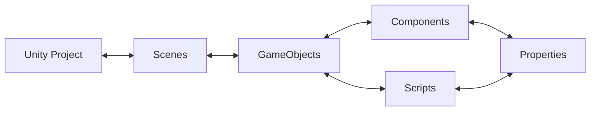

# Why Unity?

- Large and active community of professionals and hobbyists

- Used widely in many creative industry

- Cross-platform development

- Rich 2D and 3D capabilities

- Real-time experiences for AR, VR, mobile, desktop and web (Not limited to just games!)

- Continuous updates with LTS (Long Term Support) versions

- Free for students and personal use!

# Installing and Launching Unity

🖥️ The lab PCs are pre-installed with Unity 6000.0.56f1
- It is highly recommended that if you are installing Unity on your personal laptop, that you install the matching version as this will give you the option to work on your projects in the computer lab if you wish

# Creating your first project

1. Create a new Unity project through Unity Hub
![[1_Unity/0_Unity Core/images/image.png]]

2. Choose the **Universal 2D** template
![[Pasted image 20251119162205.png]]

- Set your project name - Avoid using spaces, instead separate words with a dash (my-project) or use capitalization (MyProject), this is good practice and will be important later.

- 🖥️**Computer Suite: Save the project location to the D drive**

- Leave "Connect to Unity Cloud" checked

- Leave "Use Unity Version Control" unchecked - this is separate to the recommend Git Version Control workflow and may cause confusion between the two if enabled

## Templates Explained

The different templates are all built up on one of the three ['Renderer Pipelines'](https://youtu.be/ONtM0IF7TPk) provided by Unity:

| ![[1_Unity/0_Unity Core/images/image-2.png]] | **Built-In Pipeline**   - Legacy   \- This renderer type is being phased out - Not recommended for new users as it lack certain new features                                                              |
| -------------------------------------------- | ------------------------------------------------------------------------------------------------------------------------------------------------------------------------------------------------------------------ |
| ![[1_Unity/0_Unity Core/images/image-4.png]] | **Universal Render Pipeline (URP)**   \- Modern go-to option   \- Artist-friendly features   \- Best for cross-platform   **\- Best for most cases** **- The recommended option for most projects** |
| ![[1_Unity/0_Unity Core/images/image-5.png]] | **High Definition Render Pipeline (HDRP)**   \- Advanced graphical features intended for high-end hardware   - Provides more graphical options to the developer \- Ask if you need this for your project  |

More specific templates (eg. Mobile or VR templates) build up from these pipelines by bundling certain pre-installed packages and settings. **If in doubt select the Universal 2D or Universal 3D template**
# Navigating the Engine

When you first open a new project in Unity, you will be greeted by a set of panels in the following default layout. Before doing anything, lets take a moment to go through the layout:

![[Pasted image 20251119163942.png]]

**Hierarchy**: Displays all the objects in the current scene. By default your project will have a Camera and a Light.

**Scene**: A visual representation of the game world. This is where you can move, manipulate, and arrange objects in a 2D or 3D space.

- Right Click to Pan

- Mouse Wheel to Zoom In/Out

**Inspector**: Shows detailed properties and settings for the currently selected game object, component, or asset. You can modify values like position, script variables, or change the settings of an imported asset.

**Project**/**Console**: Use the tab in the top left of the panel to change between these two windows.  
The Project window contains all the assets, scripts, and other files for your project. It’s organized into folders and allows you to manage the project’s files.  
The Console window will show you any errors/warnings in your project. Through scripting, you can output your own custom messages here which can help with identifying when certain code is run or to debug your game.

### Scenes
**Scene:** A space that holds all of the objects needed for your game. 

New projects come with a default scene titled "SampleScene." You can find it within the Project panel under Assets/Scenes:

![[image-1-1024x187.png]]

It is a good idea to rename this scene. You can name it anything as long as it roughly describes the intended contents of the scene. For example "Main Menu", "Item Store", or "The Wilds"

There is no restriction on the minimum or maximum number of scenes. A small game could only need one scene for the whole thing, while a bigger game might need one scene for every level or environment.

- For example, in a more complex project you can use scenes to organize your game:  
    \- \[Main Menu Scene\]  
    \- \[Level 1 Scene\]  
    \- \[Level 2 Scene\]  
    \- The scenes don't have to be sequential, for instance you could have \[Hub World\], \[Building 1\], \[Building 2\], \[Settings Menu\] as separate scenes that you can load at any time.

- Scenes are essential for organization, performance, and robustness!
- In-game, you can switch between scenes through scripting.
- Important Note: If you press Ctrl+S, you are only saving the currently open scene. You can save all scenes through File -> Save Project

### GameObjects and Components

- **GameObjects**: Fundamental objects within Unity  
    A scene can have an unlimited number of GameObjects, representing anything and everything in your scene from your player; to props or weapons; to a terrain or a building. Anything in your scene will be a GameObject.  
    A GameObject can have a mesh attached to it or be invisible.
    - GameObjects don't have any inherent functionality by themselves, but can be extended through the use of Components and Scripts.
    - A GameObject doesn't have to be something physical within your scene. For example we can use invisible GameObjects to hold scripts that run in the background.

- Unity has hundreds of built-in Components, but in many cases we will need to write our own Components in the form of C# Scripts.

### Creating your first GameObject

Lets create a new GameObject which will represent our player.
Create a new capsule object by **right-clicking within the Hierarchy window** and select 
2D Object -> Sprites -> Square

![[Pasted image 20251119170413.png]]

Select your new square by clicking on it in the scene or in the hierarchy
### Transform Gizmo
With an object selected, you can use the transform gizmo to move, scale, or rotate the object. Use the toolbar on the left to select your current tool:

![[20251119-1818-59.2617249-ezgif.com-optimize.gif]]

Tools on offer in the transform toolbar:
- View Tool: Easily pan across the scene without selecting objects
- Move Tool
- Rotate Tool
- Scale Tool
- Rect Tool (Change the bounds of the object without changing the scale)
- Transform Tool: Combined set of tools
Certain objects may have additional tools on offer - hover over the icon to learn what it does

> [!NOTE] Tip
> If you ever lose track of an object, select it in the hierarchy and press F to focus on it.

### Inspector Window
Whenever you have an object selected in the scene, the inspector will populate with details pertaining to that object.

Select your square and have a look at the Inspector:

![[Pasted image 20251119170610.png]]

- The top of the inspector  allows you to activate/deactivate your object, rename it, as well as Tag and Layer options which we will skip for now.

- This is followed by the object's components. On our square, by default these are:
    - **Transform**: All GameObjects have a Transform component. This holds the position, rotation, and scale of the object.
    
    - **Sprite Renderer**: Renders the sprite in the scene.
    
    - **Material:** The material for the object. The default material can not be edited but a new material can be created and dragged here to replace it.

- Finally at the bottom you will find the "Add Component" button. Use it to browse the catalogue of Unity's built-in components. If you write or import any scripts these will also be available here. Note that not all components are compatible with each other and some components can only be added once per object.

> [!NOTE] Tip
> If you are ever unsure of what a component does, click on the small question mark icon in the top right of the component - this will open up the Unity documentation page for that component.
### Properties

- We can interact with components and scripts through properties.

- Each component/script has its own set of properties which can be edited

![[Screenshot-2025-03-12-184823.png]]

If you are ever unsure what a property does, just hover over it!

> [!NOTE] Tip
> If you are ever unsure of what a property does, simply hover over it! The documentation page for the component also usually explains all of the properties in greater detail.

### Recap of Structure

- A Unity Project can have any number of Scenes
- A scene can have any number of GameObjects
- A GameObject will always have Transform and Material components, as well any number of other built-in components or Scripts
- Components and scripts will have properties which you can manipulate

## Play Mode

![[1_Unity/0_Unity Core/images/image-25.png]]

Play Mode is a core feature in Unity that lets you test your game directly in the editor. Think of it as a "preview" of your game that you can run at any time. You can find the play mode controls at the top of the Unity editor.  
When you enter Play Mode:

1. Unity compiles your scripts, turning them into internal code for Unity to run.
2. The editor interface changes (often with a colored tint to remind you you're in Play Mode)
3. The "Game" tab opens and your game starts running from the active scene
4. **Any changes in Play Mode will be reverted once you exit it**

To exit Play Mode, just click the Play button again, and Unity will return to its normal editing state.  
  
Play Mode is essential for game development, offering rapid iteration - you can make changes, test them, and refine your game without the time-consuming process of building (turning it into an application) every time.

## Physics

Unity has a powerful physics engine, handling simulation of physical interactions in your game world. This includes but is not limited to:

- **Rigid body dynamics**: Controls how solid objects move, rotate, and interact when forces are applied

- **Object movement and collisions**: Detects when objects bump into each other and calculates appropriate responses

- **Gravity and forces**: Applies gravitational pull and lets you add custom forces like wind, explosions, or magnetism

- **Material properties**: Manages how objects bounce, slide, and interact through friction, bounciness, and density

- **Joints and constraints**: Connects objects together with hinges, springs, or fixed connections

- **Ragdoll effects**: Simulates lifelike character movements when they fall or get hit

- **Raycasting**: Shoots invisible lines to detect objects in specific directions (useful for line-of-sight checks or targeting)

- **Triggers**: Special collision areas that detect when objects enter but don't physically block them

| ![[unity-intro-5.gif]] | ![[unity-intro-6.gif]] | ![[unity-intro-7.gif]] |
| ---------------------- | ---------------------- | ---------------------- |

### Rigidbody Dynamics

In real-world physics, a rigid body is any physical body that does not deform or change shape under physical forces.

To simulate physics-based behavior such as movement, gravity or collision, you need to configure objects in your scene to act as rigid bodies.

**Let's test this by creating a new Square.** **Right click in the hierarchy and select 2D Object -> Sprites -> Cube.**  Or, duplicate your existing square by selecting it and pressing Ctrl+D.

Use the inspector or transform gizmo to move the new square next to your existing one.

**Add a Rigidbody 2D component to second square by selecting it and clicking on "Add Component" in the inspector**. 

This will open up the component catalogue where you can either type in "Rigidbody" or find it under the Physics section.

![[Pasted image 20251119183243.png]]

Make sure to add "Rigidbody 2D" and not "Rigidbody", the later is intended for 3D objects and may not work how you expect. If you accidently add the wrong one, click on the icon with the 3 dots and select "Remove Component"

Press play and check out what happens to the second square! If everything is correct, you should see the second square fall down out of the camera's view. In other words, the Rigidbody component has enabled gravity on the object.
### Adding a second physics object (Floor)

So our object doesn't fall out of view, lets a floor to our scene!

Create a third square and use the transform tools to create a basic floor:

![[20251119-1838-50.1870684-ezgif.com-optimize.gif]]

Enter Play Mode again.
You may notice that the square falls through the floor. Even though the square is a rigidbody and is affected by physics, if we want it to interact with other objects in the scene, we need to add some **colliders**

### Colliders
Colliders prevent objects from going through each other. To add a collider, click on "Add Component" and search for "collider":
![[Pasted image 20251119184339.png]]

You will see a lot of colliders! Do not worry about the wide range of options - they all have the same purpose. For now, select Box Collider 2D.

Don't forget to also add a Box Collider 2D to your floor object!

### Physics Recap
![[20251119-1850-51.5628925-ezgif.com-loop-count.gif]]

- Rigidbody: Allows your object to be influenced by forces
- Collider: Set a physical boundry for your object which is used to simulate collisions between object (All objects which are part of this system need to have a collider)

- In the above example, the floor has a collider but no rigidbody - other rigidbodies will still be blocked by it, but the floor itself will not move.

# Next Steps

Congratulations, you have taken your first steps in familiarizing yourself with Unity!
Your next steps will depend on what you want your first game to look like! Feel free to continue working within this project, or create a new one!

A reminder that the best way to learn any new creative software is to just try making something - don't be scared of the program, experiment, and most importantly have fun with it! Feel free to explore the catalog of guides here or explore the thousands of beginner-friendly guides created in Unity. If you are not sure what to search, use the template "How to make \<xyz mechanic\> in Unity"

